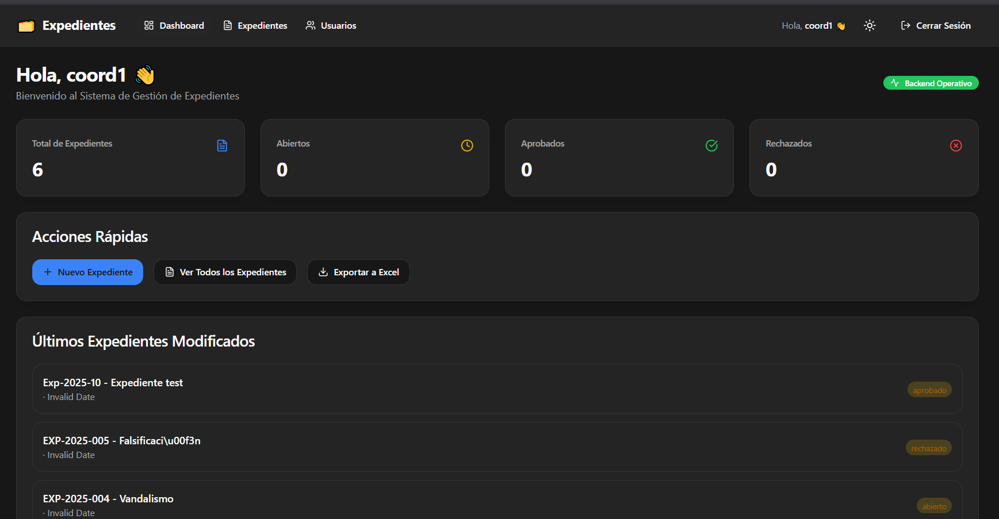
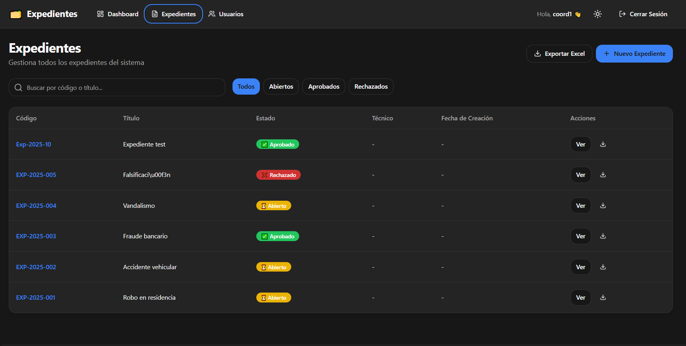
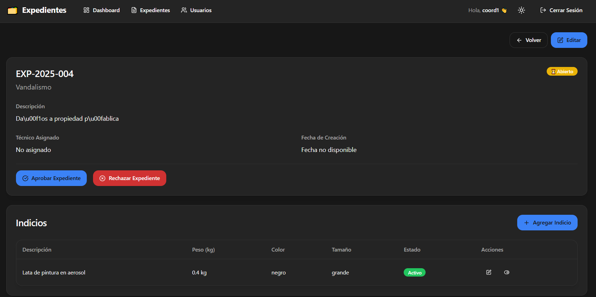
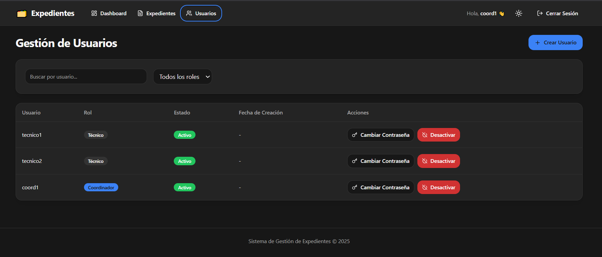

<div align="center">

# 🗂️ Sistema de Gestión de Expedientes Criminales

### *Plataforma Web Moderna para Gestión Forense*


**Sistema profesional de gestión de expedientes e indicios criminales con arquitectura empresarial, autenticación JWT y despliegue Docker**

[🚀 Quick Start](#-quick-start) • [📖 Documentación](#-documentación-completa) • [🐳 Docker Setup](#-docker-setup) • [💻 Demo](#-credenciales-de-prueba)

---

### ✨ Características Destacadas

🔐 **Auth JWT** • 👥 **RBAC** • 🎨 **Dark Mode** • 📊 **Dashboard** • 📄 **Excel Export** • 🐳 **Docker Ready** • ⚡ **Hot Reload**

</div>

---

## 📸 Vista del Sistema

<div align="center">

| Dashboard Principal | Gestión de Expedientes |
|:------------------:|:---------------------:|
|  |  |

| Detalle de Expediente | Módulo de Usuarios |
|:--------------------:|:------------------:|
|  |  |

*Sistema en ejecución mostrando las principales funcionalidades*

</div>

---

## 🎯 Descripción del Proyecto

Sistema web empresarial diseñado para optimizar la gestión de expedientes criminales e indicios forenses. Implementa arquitectura moderna con separación frontend-backend, autenticación JWT, control de acceso basado en roles (RBAC) y despliegue completo con Docker.

### 🎓 Contexto Académico

Proyecto desarrollado para el curso **Desarrollo de Software Empresarial** en la **Universidad Nacional**, demostrando competencias en:

- 🏗️ **Arquitectura de Software**: Frontend React + Backend Express + SQL Server
- 🔐 **Seguridad**: JWT, RBAC, validación de entrada, CORS
- 🐳 **DevOps**: Containerización Docker, docker-compose, CI/CD ready
- 📊 **Bases de Datos**: SQL Server con stored procedures y transacciones
- 🎨 **UI/UX Moderno**: shadcn/ui, Tailwind CSS, dark mode, responsive
- 🧪 **Testing**: Validación con Zod, manejo de errores, healthchecks

---

## ✨ Funcionalidades Principales

<table>
<tr>
<td width="33%" valign="top">

### 🔐 Autenticación & Seguridad
- ✅ Login con JWT
- ✅ Refresh tokens automáticos
- ✅ Guards de autenticación
- ✅ Control de roles (RBAC)
- ✅ Sesiones seguras
- ✅ Rate limiting

</td>
<td width="33%" valign="top">

### 📂 Gestión de Expedientes
- ✅ CRUD completo
- ✅ Estados: Abierto/Aprobado/Rechazado
- ✅ Asignación de técnicos
- ✅ Filtros avanzados
- ✅ Paginación eficiente
- ✅ Exportación a Excel

</td>
<td width="33%" valign="top">

### 🧪 Sistema de Indicios
- ✅ Vincular a expedientes
- ✅ Campos: peso, color, tamaño
- ✅ Activar/desactivar
- ✅ Edición granular
- ✅ Historial de cambios
- ✅ Búsqueda rápida

</td>
</tr>
<tr>
<td width="33%" valign="top">

### 👥 Gestión de Usuarios
- ✅ Crear técnicos/coordinadores
- ✅ Cambio de contraseñas
- ✅ Activar/desactivar cuentas
- ✅ Filtrado por rol
- ✅ Solo para coordinadores

</td>
<td width="33%" valign="top">

### 📊 Dashboard Interactivo
- ✅ Métricas en tiempo real
- ✅ Expedientes por estado
- ✅ Mis asignaciones
- ✅ Health check backend
- ✅ Acciones rápidas

</td>
<td width="33%" valign="top">

### 🎨 Interfaz Moderna
- ✅ Tema oscuro por defecto
- ✅ Responsive design
- ✅ Componentes shadcn/ui
- ✅ Notificaciones toast
- ✅ Estados de carga
- ✅ Mobile-friendly

</td>
</tr>
</table>

---

## 🛠️ Stack Tecnológico

<div align="center">

### Frontend


### Backend


### DevOps


</div>

### 📦 Dependencias Principales

```json
{
  "react": "^19.1.1",                    // Framework UI
  "typescript": "^5.9.3",                // Tipado estático
  "vite": "^7.1.12",                     // Build tool ultrarrápido
  "@tanstack/react-query": "^5.90.5",   // Server state management
  "zustand": "^5.0.8",                   // Client state (auth)
  "axios": "^1.13.1",                    // HTTP client
  "react-hook-form": "^7.66.0",          // Formularios
  "zod": "^4.1.12",                      // Validación de esquemas
  "tailwindcss": "^3.4.1",               // Utility-first CSS
  "lucide-react": "^0.552.0"             // Iconos modernos
}
```

---

## 🏗️ Arquitectura del Sistema

### Stack Completo

```
┌─────────────────────────────────────────────────────────────┐
│                      NAVEGADOR (Cliente)                    │
│                    http://localhost:5173                    │
└──────────────────────────┬──────────────────────────────────┘
                           │
                           │ HTTP/HTTPS
                           │
┌──────────────────────────▼──────────────────────────────────┐
│                   FRONTEND (React + Vite)                   │
│  ┌─────────────────────────────────────────────────────┐   │
│  │  UI Layer (shadcn/ui + Tailwind)                    │   │
│  │  ├─ LoginPage, Dashboard, ExpedientesListPage       │   │
│  │  ├─ ExpedienteDetailPage, UsersPage                 │   │
│  │  └─ Componentes: Button, Card, Table, Input         │   │
│  └───────────────────────┬─────────────────────────────┘   │
│                          │                                  │
│  ┌───────────────────────▼─────────────────────────────┐   │
│  │  State Management                                   │   │
│  │  ├─ React Query (server state + cache)             │   │
│  │  └─ Zustand (auth state: token, user, role)        │   │
│  └───────────────────────┬─────────────────────────────┘   │
│                          │                                  │
│  ┌───────────────────────▼─────────────────────────────┐   │
│  │  API Layer                                          │   │
│  │  ├─ expedientes.api.ts (CRUD, export, filters)     │   │
│  │  ├─ indicios.api.ts (CRUD por expediente)          │   │
│  │  ├─ usuarios.api.ts (gestión de usuarios)          │   │
│  │  └─ auth.api.ts (login, logout)                    │   │
│  └───────────────────────┬─────────────────────────────┘   │
│                          │                                  │
│  ┌───────────────────────▼─────────────────────────────┐   │
│  │  HTTP Client (Axios)                                │   │
│  │  ├─ Base URL: http://localhost:3000/api            │   │
│  │  ├─ Interceptor: JWT Token en headers              │   │
│  │  ├─ Interceptor: Error handling (401, 429, 500)    │   │
│  │  └─ Timeout: 30s                                   │   │
│  └───────────────────────┬─────────────────────────────┘   │
└──────────────────────────┼──────────────────────────────────┘
                           │
                           │ REST API
                           │
┌──────────────────────────▼──────────────────────────────────┐
│                BACKEND API (Express + TypeScript)           │
│                    http://localhost:3000                    │
│  ┌─────────────────────────────────────────────────────┐   │
│  │  Endpoints                                          │   │
│  │  ├─ POST   /api/auth/login                         │   │
│  │  ├─ GET    /api/expedientes?page=1&pageSize=10     │   │
│  │  ├─ POST   /api/expedientes                        │   │
│  │  ├─ GET    /api/expedientes/:id                    │   │
│  │  ├─ PUT    /api/expedientes/:id                    │   │
│  │  ├─ PATCH  /api/expedientes/:id/estado             │   │
│  │  ├─ GET    /api/indicios/expediente/:id            │   │
│  │  ├─ POST   /api/indicios                           │   │
│  │  ├─ GET    /api/usuarios?role=tecnico              │   │
│  │  ├─ POST   /api/usuarios                           │   │
│  │  └─ GET    /health                                 │   │
│  └───────────────────────┬─────────────────────────────┘   │
│                          │                                  │
│  ┌───────────────────────▼─────────────────────────────┐   │
│  │  Middleware                                         │   │
│  │  ├─ JWT Verification                               │   │
│  │  ├─ Role-based Access Control                      │   │
│  │  ├─ Rate Limiting                                  │   │
│  │  ├─ CORS                                           │   │
│  │  └─ Error Handling                                 │   │
│  └───────────────────────┬─────────────────────────────┘   │
│                          │                                  │
│  ┌───────────────────────▼─────────────────────────────┐   │
│  │  Business Logic                                     │   │
│  │  ├─ Validación de datos (Zod schemas)             │   │
│  │  ├─ Autorización granular                         │   │
│  │  ├─ Transacciones SQL                             │   │
│  │  └─ Generación de Excel                           │   │
│  └───────────────────────┬─────────────────────────────┘   │
└──────────────────────────┼──────────────────────────────────┘
                           │
                           │ SQL Queries
                           │
┌──────────────────────────▼──────────────────────────────────┐
│              SQL SERVER 2022 DATABASE                       │
│                    localhost:1433                           │
│  ┌─────────────────────────────────────────────────────┐   │
│  │  Tablas                                             │   │
│  │  ├─ Usuarios (id, username, password, rol, ...)    │   │
│  │  ├─ Expedientes (id, titulo, estado, tecnico, ...) │   │
│  │  └─ Indicios (id, expedienteId, descripcion, ...)  │   │
│  └─────────────────────────────────────────────────────┘   │
│  ┌─────────────────────────────────────────────────────┐   │
│  │  Stored Procedures & Triggers                       │   │
│  │  ├─ sp_GetExpedientesByTecnico                     │   │
│  │  ├─ sp_UpdateEstadoExpediente                      │   │
│  │  └─ trg_AuditExpedientes                           │   │
│  └─────────────────────────────────────────────────────┘   │
└─────────────────────────────────────────────────────────────┘
```

### 🔄 Flujo de Datos (Ejemplo: Crear Expediente)

```
1. Usuario completa formulario → ExpedienteForm.tsx

2. Validación Zod → esquema en expedientes.types.ts

3. Submit → useCreateExpediente (React Query mutation)

4. API call → expedientes.api.ts: createExpediente()

5. Fetcher (Axios) agrega JWT token en headers

6. POST http://localhost:3000/api/expedientes
   Headers: { Authorization: "Bearer <token>" }
   Body: { titulo, descripcion, tecnicoAsignadoId, estado }

7. Backend valida JWT → middleware verifyToken

8. Backend valida rol → solo "coordinador" puede crear

9. Backend valida datos → Zod schema

10. Insert SQL → tabla Expedientes

11. Response: { success: true, data: { id: 123, ... } }

12. React Query actualiza cache → invalidateQueries(['expedientes'])

13. UI re-renderiza → ExpedientesListPage muestra nuevo expediente

14. Toast notification → "Expediente creado exitosamente ✅"
```

---

## 🚀 Quick Start

### 🔧 Requisitos Previos

| Software | Versión | Descarga |
|----------|---------|----------|
| **Node.js** | >= 20.x | [nodejs.org](https://nodejs.org) |
| **Docker Desktop** | >= 24.x | [docker.com](https://www.docker.com/products/docker-desktop/) |
| **Git** | >= 2.x | [git-scm.com](https://git-scm.com) |

### ⚡ Instalación Rápida (Desarrollo Local)

```bash
# 1️⃣ Clonar repositorio
git clone https://github.com/GuillermoGome2z/Frontend-Expedientes.git
cd Frontend-Expedientes-1

# 2️⃣ Instalar dependencias
npm install

# 3️⃣ Configurar variables de entorno
# (El archivo .env ya existe con la configuración correcta)
cat .env
# VITE_API_URL=http://localhost:3000/api

# 4️⃣ Iniciar servidor de desarrollo
npm run dev

# 5️⃣ Abrir en navegador
# 🌐 http://localhost:5173
```

### 🐳 Docker Setup

#### Opción 1: Stack Completo con Docker (Recomendado)

```bash
# 1️⃣ Verificar configuración
.\verify-integration.ps1

# 2️⃣ Levantar todos los servicios (Frontend + Backend + SQL Server)
npm run docker:up

# 3️⃣ Esperar ~60 segundos para que todo inicie

# 4️⃣ Verificar servicios
docker compose ps

# 5️⃣ Abrir aplicación
# 🌐 Frontend:  http://localhost:5173
# 🔌 Backend:   http://localhost:3000/api
# 📚 Swagger:   http://localhost:3000/docs
# 💚 Health:    http://localhost:3000/health
```

#### Arquitectura Docker

```
┌────────────────────────────────────────┐
│     TU NAVEGADOR (Fuera de Docker)     │
│                                        │
│  localhost:5173 ──► Frontend (React)  │
│  localhost:3000 ──► Backend (Express) │
│  localhost:3000/docs ──► Swagger UI   │
└──────────┬─────────────┬───────────────┘
           │             │
┌──────────▼─────────────▼───────────────┐
│       DOCKER HOST (tu PC)              │
│  ┌────────────┐  ┌────────────┐       │
│  │ web        │  │ api        │       │
│  │ :5173      │  │ :3000      │       │
│  │ (Vite)     │◄─┤ (Express)  │       │
│  │            │  │            │       │
│  │ Hot Reload │  │ Nodemon    │       │
│  └────────────┘  └──────┬─────┘       │
│                         │              │
│                  ┌──────▼─────┐        │
│                  │ sqlserver  │        │
│                  │ :1433      │        │
│                  │ (SQL 2022) │        │
│                  └────────────┘        │
└────────────────────────────────────────┘

Volúmenes persistentes:
  • sqlserver-data (base de datos)
  • ./src (código frontend - hot reload)
  • ./backend (código backend - nodemon)
```

### 📋 Scripts npm Disponibles

```bash
# Desarrollo
npm run dev              # Vite dev server (puerto 5173)
npm run build            # Build de producción
npm run preview          # Preview del build

# Docker
npm run docker:up        # Levantar stack completo
npm run docker:down      # Detener servicios
npm run docker:logs      # Ver logs en tiempo real
npm run docker:restart   # Reiniciar servicios

# Calidad de código
npm run lint             # ESLint
```

---

## 🔐 Credenciales de Prueba

### 👤 Usuarios del Sistema

| Rol | Username | Password | Permisos |
|-----|----------|----------|----------|
| **Coordinador** | `coord1` | `Coord123!` | ✅ Todos los permisos |
| **Técnico** | `tecnico1` | `tecnico123` | 🔒 Solo sus expedientes |

### 🗄️ Base de Datos SQL Server

```
Server:   localhost,1433
User:     sa
Password: YourStrong!Passw0rd
Database: ExpedientesDB
```

---

## 📚 Documentación Completa

### 📖 Guías de Integración

| Documento | Descripción | Tamaño |
|-----------|-------------|--------|
| **[FRONTEND_INTEGRATION_GUIDE.md](FRONTEND_INTEGRATION_GUIDE.md)** | 🌟 Guía completa de integración frontend-backend | 3000+ líneas |
| **[QUICKSTART_INTEGRATION.md](QUICKSTART_INTEGRATION.md)** | ⚡ TL;DR para empezar en 5 minutos | 500+ líneas |
| **[INTEGRATION_SUMMARY.md](INTEGRATION_SUMMARY.md)** | 📊 Resumen ejecutivo del proyecto | 800+ líneas |

### 🐳 Documentación Docker

| Documento | Descripción |
|-----------|-------------|
| **[DOCKER_SETUP.md](DOCKER_SETUP.md)** | Setup Docker detallado con evidencias |
| **[DOCKER_QUICKSTART.md](DOCKER_QUICKSTART.md)** | Comandos Docker esenciales |

### 🛠️ Documentación Técnica

| Documento | Descripción |
|-----------|-------------|
| **[MIGRATION_GUIDE.md](MIGRATION_GUIDE.md)** | Guía técnica de migración y refactorización |
| **[BACKEND_CHECKLIST.md](BACKEND_CHECKLIST.md)** | Checklist de implementación backend |

---

## 🌐 Endpoints de la API

### 🔐 Autenticación

```http
POST /api/auth/login
Content-Type: application/json

{
  "username": "coord1",
  "password": "Coord123!"
}

Response 200 OK:
{
  "success": true,
  "data": {
    "token": "eyJhbGciOiJIUzI1NiIsInR5cCI6IkpXVCJ9...",
    "user": {
      "id": 1,
      "username": "coord1",
      "rol": "coordinador",
      "nombreCompleto": "Coordinador Principal"
    }
  }
}
```

### 📂 Expedientes

| Método | Endpoint | Descripción | Requiere Auth |
|--------|----------|-------------|---------------|
| `GET` | `/api/expedientes?page=1&pageSize=10` | Listar expedientes | ✅ |
| `GET` | `/api/expedientes/:id` | Obtener detalle | ✅ |
| `POST` | `/api/expedientes` | Crear expediente | ✅ Coordinador |
| `PUT` | `/api/expedientes/:id` | Actualizar | ✅ |
| `PATCH` | `/api/expedientes/:id/estado` | Cambiar estado | ✅ Coordinador |
| `GET` | `/api/expedientes/export` | Exportar a Excel | ✅ |

### 🧪 Indicios

| Método | Endpoint | Descripción | Requiere Auth |
|--------|----------|-------------|---------------|
| `GET` | `/api/indicios/expediente/:id` | Listar por expediente | ✅ |
| `POST` | `/api/indicios` | Crear indicio | ✅ |
| `PUT` | `/api/indicios/:id` | Actualizar | ✅ |
| `PATCH` | `/api/indicios/:id/activo` | Activar/desactivar | ✅ |

### 👥 Usuarios (Solo Coordinador)

| Método | Endpoint | Descripción | Requiere Auth |
|--------|----------|-------------|---------------|
| `GET` | `/api/usuarios?page=1&pageSize=10` | Listar usuarios | ✅ Coordinador |
| `POST` | `/api/usuarios` | Crear usuario | ✅ Coordinador |
| `PATCH` | `/api/usuarios/:id/password` | Cambiar contraseña | ✅ Coordinador |
| `PATCH` | `/api/usuarios/:id/activo` | Activar/desactivar | ✅ Coordinador |

### 💚 Health Check

```http
GET /health

Response 200 OK:
{
  "status": "ok",
  "timestamp": "2025-11-01T12:00:00.000Z",
  "uptime": 123456,
  "database": "connected"
}
```

### 📚 Swagger UI

Documentación interactiva de todos los endpoints:

🌐 **http://localhost:3000/docs**

---

## 👥 Roles y Permisos (RBAC)

### Matriz de Permisos

| Acción | Técnico | Coordinador |
|--------|---------|-------------|
| 🔐 Login | ✅ | ✅ |
| 📊 Ver Dashboard | ✅ | ✅ |
| 📂 Ver Expedientes | 🔒 Solo suyos | ✅ Todos |
| ➕ Crear Expediente | ❌ | ✅ |
| ✏️ Editar Expediente | 🔒 Suyos (si Abierto) | 🔒 Todos (si Abierto) |
| ✅ Aprobar Expediente | ❌ | ✅ |
| ❌ Rechazar Expediente | ❌ | ✅ |
| 🧪 Ver Indicios | 🔒 De sus expedientes | ✅ Todos |
| ➕ Crear Indicios | 🔒 En sus expedientes (Abiertos) | ✅ En cualquiera (Abiertos) |
| ✏️ Editar Indicios | 🔒 De sus expedientes (Abiertos) | ✅ Todos (Abiertos) |
| 📥 Exportar Expedientes | 🔒 Solo suyos | ✅ Todos |
| 👥 Gestionar Usuarios | ❌ | ✅ |
| 🔑 Cambiar Contraseñas | ❌ | ✅ |

### 🔒 Estados de Expedientes

```
Abierto ──────► En Revisión ──────► Aprobado
                    │
                    └──────────────► Rechazado
                                      (requiere justificación)
```

- **Abierto**: Editable por técnico asignado o coordinador
- **En Revisión**: Solo lectura para técnicos, editable para coordinadores
- **Aprobado**: Solo lectura para todos
- **Rechazado**: Solo lectura, muestra justificación

---

## 📁 Estructura del Proyecto

```
Frontend-Expedientes-1/
├── 📄 README.md                          # Este archivo
├── 📄 package.json                       # Dependencias y scripts
├── 📄 tsconfig.json                      # Configuración TypeScript
├── 📄 vite.config.ts                     # Configuración Vite
├── 📄 tailwind.config.js                 # Configuración Tailwind
├── 📄 .env                               # Variables de entorno
├── 🐳 docker-compose.yml                 # Orquestación Docker
├── 🐳 Dockerfile                         # Imagen Docker del frontend
├── 📂 public/                            # Archivos estáticos
├── 📂 src/
│   ├── 📄 main.tsx                       # Entry point
│   ├── 📄 App.tsx                        # Componente raíz
│   ├── 📂 app/                           # Configuración global
│   │   ├── MainLayout.tsx                # Layout con navbar
│   │   ├── providers.tsx                 # React Query + Router
│   │   ├── queryClient.ts                # Config React Query
│   │   └── router.tsx                    # Definición de rutas
│   ├── 📂 auth/                          # Módulo de autenticación
│   │   ├── auth.api.ts                   # Login endpoint
│   │   ├── auth.store.ts                 # Zustand store (JWT)
│   │   ├── auth.types.ts                 # Tipos de auth
│   │   ├── LoginPage.tsx                 # Página de login
│   │   ├── LogoutButton.tsx              # Botón de logout
│   │   ├── RequireAuth.tsx               # Guard: requiere login
│   │   └── RequireRole.tsx               # Guard: requiere rol
│   ├── 📂 components/                    # Componentes globales
│   │   ├── ThemeToggle.tsx               # Toggle dark/light
│   │   ├── HealthChip.tsx                # Estado del backend
│   │   └── 📂 ui/                        # shadcn/ui components
│   │       ├── button.tsx
│   │       ├── card.tsx
│   │       ├── input.tsx
│   │       ├── table.tsx
│   │       ├── badge.tsx
│   │       └── ...
│   ├── 📂 dashboard/                     # Módulo Dashboard
│   │   └── DashboardPage.tsx             # Métricas y resumen
│   ├── 📂 expedientes/                   # Módulo Expedientes
│   │   ├── expedientes.api.ts            # API client
│   │   ├── expedientes.types.ts          # Tipos TypeScript
│   │   ├── ExpedientesListPage.tsx       # Lista con filtros
│   │   ├── ExpedienteDetailPage.tsx      # Detalle + indicios
│   │   ├── ExpedienteCreatePage.tsx      # Crear/editar
│   │   ├── ExpedienteForm.tsx            # Formulario
│   │   └── EstadoBadge.tsx               # Badge de estado
│   ├── 📂 indicios/                      # Módulo Indicios
│   │   ├── indicios.api.ts               # API client
│   │   ├── indicios.types.ts             # Tipos TypeScript
│   │   ├── IndiciosList.tsx              # Lista de indicios
│   │   └── IndicioForm.tsx               # Formulario
│   ├── 📂 usuarios/                      # Módulo Usuarios
│   │   ├── usuarios.api.ts               # API client
│   │   ├── usuarios.types.ts             # Tipos TypeScript
│   │   └── UsersPage.tsx                 # CRUD usuarios
│   ├── 📂 shared/                        # Utilidades compartidas
│   │   ├── env.ts                        # Validación de env vars
│   │   ├── fetcher.ts                    # Axios + interceptors
│   │   ├── 📂 hooks/
│   │   │   └── useApiError.ts            # Hook de errores
│   │   └── 📂 ui/
│   │       ├── DataTable.tsx             # Tabla reutilizable
│   │       ├── EmptyState.tsx            # Estado vacío
│   │       ├── ErrorState.tsx            # Estado de error
│   │       └── Page.tsx                  # Layout de página
│   └── 📂 lib/
│       └── utils.ts                      # Utilidades (cn, clsx)
└── 📂 docs/                              # Documentación
    ├── FRONTEND_INTEGRATION_GUIDE.md
    ├── QUICKSTART_INTEGRATION.md
    ├── INTEGRATION_SUMMARY.md
    ├── DOCKER_SETUP.md
    ├── MIGRATION_GUIDE.md
    └── ...
```

---

## 🐛 Troubleshooting

### ❌ Error: "Network Error" al hacer login

**Causa**: Backend no está corriendo o URL incorrecta

**Solución**:
```bash
# Verificar que backend esté corriendo
curl http://localhost:3000/health

# Ver logs del backend
docker compose logs api

# Reiniciar servicios
npm run docker:restart
```

### ❌ Error: "CORS policy blocked"

**Causa**: Frontend corriendo en puerto diferente o CORS mal configurado

**Solución**: El backend ya tiene CORS configurado para:
- `http://localhost:5173`
- `http://localhost:3000`
- `http://127.0.0.1:5173`

Si cambias el puerto del frontend, actualiza la configuración CORS del backend.

### ❌ Error: Puerto 5173 ocupado

**Solución**:
```bash
# Windows
netstat -ano | findstr :5173
taskkill /PID <PID> /F

# O cambiar puerto en docker-compose.yml
ports:
  - "5174:5173"  # Cambiar a 5174
```

### ❌ Hot reload no funciona en Docker

**Solución**: Ya está configurado con `usePolling: true` en `vite.config.ts`. Si persiste:
```bash
docker compose restart web
```

### ❌ Token expirado (401 Unauthorized)

**Solución**: El sistema ya maneja esto automáticamente:
- Interceptor de Axios detecta 401
- Limpia el token del localStorage
- Redirige a `/login`

Solo necesitas hacer login nuevamente.

---

## 🚀 Deployment

### Build de Producción

```bash
# 1️⃣ Compilar TypeScript y generar build
npm run build

# 2️⃣ Preview del build (opcional)
npm run preview

# 3️⃣ La carpeta dist/ contiene los archivos estáticos
ls dist/
```

### Variables de Entorno para Producción

```env
# .env.production
VITE_API_URL=https://api.tudominio.com/api
NODE_ENV=production
```

### Deployment con Docker

```bash
# Build de imagen de producción
docker build -t expedientes-frontend:prod .

# Run
docker run -d -p 80:80 expedientes-frontend:prod
```

### Plataformas Recomendadas

| Plataforma | Servicio | Uso |
|------------|----------|-----|
| **Vercel** | Frontend | Deploy automático desde GitHub |
| **Railway** | Backend + DB | PostgreSQL o SQL Server |
| **Render** | Full Stack | Todo en una plataforma |
| **Azure** | Enterprise | App Services + SQL Database |
| **AWS** | Enterprise | EC2 + RDS + S3 |

---

## 🤝 Contribución

### Workflow de Contribución

```bash
# 1️⃣ Fork del repositorio
# 2️⃣ Clonar tu fork
git clone https://github.com/TU-USUARIO/Frontend-Expedientes.git

# 3️⃣ Crear branch de feature
git checkout -b feature/nueva-funcionalidad

# 4️⃣ Hacer commits semánticos
git commit -m "feat: agregar filtro por fecha en expedientes"

# 5️⃣ Push a tu fork
git push origin feature/nueva-funcionalidad

# 6️⃣ Crear Pull Request en GitHub
```

### Commits Semánticos

| Tipo | Descripción | Ejemplo |
|------|-------------|---------|
| `feat:` | Nueva funcionalidad | `feat: agregar exportación PDF` |
| `fix:` | Corrección de bug | `fix: corregir paginación` |
| `docs:` | Cambios en documentación | `docs: actualizar README` |
| `style:` | Cambios de formato | `style: aplicar Prettier` |
| `refactor:` | Refactorización | `refactor: mejorar fetcher` |
| `test:` | Agregar tests | `test: agregar tests de login` |
| `chore:` | Tareas de mantenimiento | `chore: actualizar deps` |

---

## 👨‍💻 Autor

<div align="center">

### Guillermo Gómez

**Estudiante de Ingeniería de Sistemas**  
Universidad Nacional

[](https://github.com/GuillermoGome2z)
[](mailto:tu-email@ejemplo.com)

**Proyecto Académico**: Desarrollo de Software Empresarial  
**Fecha**: Noviembre 2025

</div>

---

## 📄 Licencia

Este proyecto fue desarrollado con **fines académicos** para el curso de Desarrollo de Software Empresarial.

```
MIT License - Copyright (c) 2025 Guillermo Gómez
```

---

## 🙏 Agradecimientos

<div align="center">

Tecnologías y Herramientas que hicieron posible este proyecto:

[](https://react.dev/)
[](https://www.typescriptlang.org/)
[](https://vitejs.dev/)
[](https://tailwindcss.com/)
[](https://ui.shadcn.com/)
[](https://tanstack.com/query/latest)
[](https://www.docker.com/)

</div>

---

<div align="center">

## 🌟 ¡Gracias por usar este sistema!

**Si este proyecto te fue útil, considera darle una ⭐ en GitHub**

---

### 🚀 Quick Links

[📖 Documentación](FRONTEND_INTEGRATION_GUIDE.md) • [⚡ Quick Start](QUICKSTART_INTEGRATION.md) • [🐳 Docker Setup](DOCKER_SETUP.md) • [📊 API Docs](http://localhost:3000/docs)

---

**Última actualización**: Noviembre 1, 2025  
**Versión**: 1.0.0  
**Estado**: ✅ Producción Ready

Made with ❤️ by [Guillermo Gómez](https://github.com/GuillermoGome2z)

</div>
